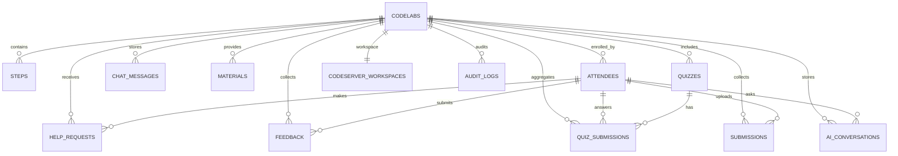

# Database Schema

This document describes the SQLite schema used by Open Codelabs.

## ERD (Entity Relationship Diagram)



## Table reference

### codelabs

Stores codelab metadata and configuration.

```sql
CREATE TABLE IF NOT EXISTS codelabs (
    id VARCHAR(255) PRIMARY KEY NOT NULL,
    title VARCHAR(255) NOT NULL,
    description TEXT NOT NULL,
    author VARCHAR(255) NOT NULL,
    created_at TEXT DEFAULT CURRENT_TIMESTAMP,
    is_public INTEGER NOT NULL DEFAULT 1,
    quiz_enabled INTEGER DEFAULT 0,
    require_quiz INTEGER DEFAULT 0,
    require_feedback INTEGER DEFAULT 0,
    guide_markdown TEXT
);
```

| Column | Type | Description | Constraints |
|------|------|------|------|
| `id` | VARCHAR | UUID | PRIMARY KEY |
| `title` | VARCHAR | Codelab title | NOT NULL |
| `description` | TEXT | Codelab description | NOT NULL |
| `author` | VARCHAR | Author name | NOT NULL |
| `created_at` | TEXT | Created time | DEFAULT CURRENT_TIMESTAMP |
| `is_public` | INTEGER | Visibility (1: public, 0: private) | DEFAULT 1 |
| `quiz_enabled` | INTEGER | Quiz enabled | DEFAULT 0 |
| `require_quiz` | INTEGER | Require quiz to complete | DEFAULT 0 |
| `require_feedback` | INTEGER | Require feedback to complete | DEFAULT 0 |
| `guide_markdown` | TEXT | Prep guide Markdown | - |

### steps

Stores individual steps in a codelab.

```sql
CREATE TABLE IF NOT EXISTS steps (
    id VARCHAR(255) PRIMARY KEY NOT NULL,
    codelab_id VARCHAR(255) NOT NULL,
    step_number INTEGER NOT NULL,
    title VARCHAR(255) NOT NULL,
    content_markdown TEXT NOT NULL,
    FOREIGN KEY (codelab_id) REFERENCES codelabs(id) ON DELETE CASCADE
);
```

| Column | Type | Description | Constraints |
|------|------|------|------|
| `id` | VARCHAR | UUID | PRIMARY KEY |
| `codelab_id` | VARCHAR | Codelab ID | FOREIGN KEY |
| `step_number` | INTEGER | Step order (starts at 1) | NOT NULL |
| `title` | VARCHAR | Step title | NOT NULL |
| `content_markdown` | TEXT | Markdown content | NOT NULL |

### attendees

Stores attendee information.

```sql
CREATE TABLE IF NOT EXISTS attendees (
    id VARCHAR(255) PRIMARY KEY NOT NULL,
    codelab_id VARCHAR(255) NOT NULL,
    name VARCHAR(255) NOT NULL,
    code VARCHAR(255) NOT NULL,
    email VARCHAR(255),
    created_at TEXT DEFAULT CURRENT_TIMESTAMP,
    current_step INTEGER DEFAULT 1,
    is_completed INTEGER DEFAULT 0,
    completed_at TEXT,
    FOREIGN KEY (codelab_id) REFERENCES codelabs(id) ON DELETE CASCADE
);
```

| Column | Type | Description | Constraints |
|------|------|------|------|
| `id` | VARCHAR | UUID | PRIMARY KEY |
| `codelab_id` | VARCHAR | Codelab ID | FOREIGN KEY |
| `name` | VARCHAR | Attendee name | NOT NULL |
| `code` | VARCHAR | Attendee code | NOT NULL |
| `email` | VARCHAR | Email (optional) | - |
| `current_step` | INTEGER | Current step number | DEFAULT 1 |
| `is_completed` | INTEGER | Completion status (1: completed, 0: in progress) | DEFAULT 0 |
| `completed_at` | TEXT | Completion time | - |
| `created_at` | TEXT | Registration time | DEFAULT CURRENT_TIMESTAMP |

### help_requests

Stores attendee help requests.

```sql
CREATE TABLE IF NOT EXISTS help_requests (
    id VARCHAR(255) PRIMARY KEY NOT NULL,
    codelab_id VARCHAR(255) NOT NULL,
    attendee_id VARCHAR(255) NOT NULL,
    step_number INTEGER NOT NULL,
    status VARCHAR(50) DEFAULT 'pending',
    created_at TEXT DEFAULT CURRENT_TIMESTAMP,
    FOREIGN KEY (codelab_id) REFERENCES codelabs(id) ON DELETE CASCADE,
    FOREIGN KEY (attendee_id) REFERENCES attendees(id) ON DELETE CASCADE
);
```

| Column | Type | Description | Constraints |
|------|------|------|------|
| `id` | VARCHAR | UUID | PRIMARY KEY |
| `codelab_id` | VARCHAR | Codelab ID | FOREIGN KEY |
| `attendee_id` | VARCHAR | Requester ID | FOREIGN KEY |
| `step_number` | INTEGER | Blocked step number | NOT NULL |
| `status` | VARCHAR | Status (pending/resolved) | DEFAULT 'pending' |
| `created_at` | TEXT | Request time | DEFAULT CURRENT_TIMESTAMP |

### chat_messages

Stores real-time chat and DM messages.

```sql
CREATE TABLE IF NOT EXISTS chat_messages (
    id VARCHAR(255) PRIMARY KEY NOT NULL,
    codelab_id VARCHAR(255) NOT NULL,
    sender_name VARCHAR(255) NOT NULL,
    message TEXT NOT NULL,
    created_at TEXT DEFAULT CURRENT_TIMESTAMP,
    msg_type VARCHAR(50) DEFAULT 'chat',
    target_id VARCHAR(255),
    FOREIGN KEY (codelab_id) REFERENCES codelabs(id) ON DELETE CASCADE
);
```

| Column | Type | Description | Constraints |
|------|------|------|------|
| `id` | VARCHAR | UUID | PRIMARY KEY |
| `codelab_id` | VARCHAR | Codelab ID | FOREIGN KEY |
| `sender_name` | VARCHAR | Sender name | NOT NULL |
| `message` | TEXT | Message | NOT NULL |
| `msg_type` | VARCHAR | Type (chat/dm) | DEFAULT 'chat' |
| `target_id` | VARCHAR | DM target ID (attendee ID) | - |
| `created_at` | TEXT | Sent time | DEFAULT CURRENT_TIMESTAMP |

### feedback

Stores attendee feedback.

```sql
CREATE TABLE IF NOT EXISTS feedback (
    id VARCHAR(255) PRIMARY KEY,
    codelab_id VARCHAR(255) NOT NULL,
    attendee_id VARCHAR(255),
    difficulty VARCHAR(50) NOT NULL,
    satisfaction VARCHAR(50) NOT NULL,
    comment TEXT,
    created_at TEXT DEFAULT CURRENT_TIMESTAMP,
    FOREIGN KEY (codelab_id) REFERENCES codelabs(id) ON DELETE CASCADE
);
```

| Column | Type | Description | Constraints |
|------|------|------|------|
| `id` | VARCHAR | UUID | PRIMARY KEY |
| `codelab_id` | VARCHAR | Codelab ID | FOREIGN KEY |
| `attendee_id` | VARCHAR | Submitter ID | UNIQUE (with codelab_id) |
| `difficulty` | VARCHAR | Difficulty (1-5) | NOT NULL |
| `satisfaction` | VARCHAR | Satisfaction (1-5) | NOT NULL |
| `comment` | TEXT | Comment (optional) | - |
| `created_at` | TEXT | Submitted time | DEFAULT CURRENT_TIMESTAMP |

### materials

Stores materials attached to a codelab (links or files).

```sql
CREATE TABLE IF NOT EXISTS materials (
    id VARCHAR(255) PRIMARY KEY NOT NULL,
    codelab_id VARCHAR(255) NOT NULL,
    title VARCHAR(255) NOT NULL,
    material_type VARCHAR(50) NOT NULL,
    link_url TEXT,
    file_path TEXT,
    created_at TEXT DEFAULT CURRENT_TIMESTAMP,
    FOREIGN KEY (codelab_id) REFERENCES codelabs(id) ON DELETE CASCADE
);
```

| Column | Type | Description | Constraints |
|------|------|------|------|
| `id` | VARCHAR | UUID | PRIMARY KEY |
| `codelab_id` | VARCHAR | Codelab ID | FOREIGN KEY |
| `title` | VARCHAR | Material title | NOT NULL |
| `material_type` | VARCHAR | Type (link/file) | NOT NULL |
| `link_url` | TEXT | Link URL | - |
| `file_path` | TEXT | File path | - |
| `created_at` | TEXT | Registered time | DEFAULT CURRENT_TIMESTAMP |

### quizzes

Stores quiz questions included in a codelab.

```sql
CREATE TABLE IF NOT EXISTS quizzes (
    id VARCHAR(255) PRIMARY KEY NOT NULL,
    codelab_id VARCHAR(255) NOT NULL,
    question TEXT NOT NULL,
    options TEXT NOT NULL,
    correct_answer INTEGER NOT NULL,
    created_at TEXT DEFAULT CURRENT_TIMESTAMP,
    quiz_type TEXT DEFAULT 'multiple_choice'
);
```

| Column | Type | Description | Constraints |
|------|------|------|------|
| `id` | VARCHAR | UUID | PRIMARY KEY |
| `codelab_id` | VARCHAR | Codelab ID | FOREIGN KEY |
| `question` | TEXT | Question | NOT NULL |
| `options` | TEXT | Options (JSON array) | NOT NULL |
| `correct_answer` | INTEGER | Correct index or value | NOT NULL |
| `quiz_type` | TEXT | Type (multiple_choice/descriptive) | DEFAULT 'multiple_choice' |
| `created_at` | TEXT | Created time | DEFAULT CURRENT_TIMESTAMP |

### quiz_submissions

Stores attendee quiz submissions and grading results.

```sql
CREATE TABLE IF NOT EXISTS quiz_submissions (
    id VARCHAR(255) PRIMARY KEY NOT NULL,
    codelab_id VARCHAR(255) NOT NULL,
    attendee_id VARCHAR(255) NOT NULL,
    quiz_id VARCHAR(255) NOT NULL,
    answer TEXT NOT NULL,
    is_correct INTEGER NOT NULL,
    created_at TEXT DEFAULT CURRENT_TIMESTAMP,
    FOREIGN KEY (codelab_id) REFERENCES codelabs(id) ON DELETE CASCADE,
    FOREIGN KEY (attendee_id) REFERENCES attendees(id) ON DELETE CASCADE,
    FOREIGN KEY (quiz_id) REFERENCES quizzes(id) ON DELETE CASCADE
);
```

| Column | Type | Description | Constraints |
|------|------|------|------|
| `id` | VARCHAR | UUID | PRIMARY KEY |
| `codelab_id` | VARCHAR | Codelab ID | FOREIGN KEY |
| `attendee_id` | VARCHAR | Attendee ID | FOREIGN KEY |
| `quiz_id` | VARCHAR | Quiz ID | FOREIGN KEY |
| `answer` | TEXT | Submitted answer | NOT NULL |
| `is_correct` | INTEGER | Correct (1) / incorrect (0) | NOT NULL |
| `created_at` | TEXT | Submitted time | DEFAULT CURRENT_TIMESTAMP |

### submissions

Stores attendee submission files (assignments).

```sql
CREATE TABLE IF NOT EXISTS submissions (
    id TEXT PRIMARY KEY,
    codelab_id TEXT NOT NULL,
    attendee_id TEXT NOT NULL,
    file_path TEXT NOT NULL,
    file_name TEXT NOT NULL,
    file_size INTEGER NOT NULL,
    created_at DATETIME DEFAULT CURRENT_TIMESTAMP,
    FOREIGN KEY (codelab_id) REFERENCES codelabs (id),
    FOREIGN KEY (attendee_id) REFERENCES attendees (id)
);
```

| Column | Type | Description | Constraints |
|------|------|------|------|
| `id` | TEXT | UUID | PRIMARY KEY |
| `codelab_id` | TEXT | Codelab ID | FOREIGN KEY |
| `attendee_id` | TEXT | Attendee ID | FOREIGN KEY |
| `file_path` | TEXT | Storage path | NOT NULL |
| `file_name` | TEXT | Original filename | NOT NULL |
| `file_size` | INTEGER | File size | NOT NULL |
| `created_at` | DATETIME | Submitted time | DEFAULT CURRENT_TIMESTAMP |

### audit_logs

Stores admin/attendee event logs.

```sql
CREATE TABLE IF NOT EXISTS audit_logs (
    id VARCHAR(255) PRIMARY KEY NOT NULL,
    action VARCHAR(255) NOT NULL,
    actor_type VARCHAR(50) NOT NULL,
    actor_id VARCHAR(255),
    target_id VARCHAR(255),
    codelab_id VARCHAR(255),
    ip VARCHAR(64),
    user_agent TEXT,
    metadata TEXT,
    created_at TEXT DEFAULT CURRENT_TIMESTAMP
);
```

| Column | Type | Description | Constraints |
|------|------|------|------|
| `id` | VARCHAR | UUID | PRIMARY KEY |
| `action` | VARCHAR | Event key | NOT NULL |
| `actor_type` | VARCHAR | Actor type (admin/attendee) | NOT NULL |
| `actor_id` | VARCHAR | Actor ID | - |
| `target_id` | VARCHAR | Target ID | - |
| `codelab_id` | VARCHAR | Codelab ID | - |
| `ip` | VARCHAR | Request IP | - |
| `user_agent` | TEXT | User-Agent | - |
| `metadata` | TEXT | Extra metadata (JSON) | - |
| `created_at` | TEXT | Created time | DEFAULT CURRENT_TIMESTAMP |

### codeserver_workspaces

Stores code-server workspaces.

```sql
CREATE TABLE IF NOT EXISTS codeserver_workspaces (
    id TEXT PRIMARY KEY DEFAULT (lower(hex(randomblob(16)))),
    codelab_id TEXT NOT NULL UNIQUE,
    url TEXT NOT NULL,
    created_at TEXT NOT NULL DEFAULT (datetime('now')),
    structure_type TEXT NOT NULL DEFAULT 'branch',
    FOREIGN KEY (codelab_id) REFERENCES codelabs(id) ON DELETE CASCADE
);
```

| Column | Type | Description | Constraints |
|------|------|------|------|
| `id` | TEXT | UUID | PRIMARY KEY |
| `codelab_id` | TEXT | Codelab ID | UNIQUE, FOREIGN KEY |
| `url` | TEXT | Workspace URL | NOT NULL |
| `structure_type` | TEXT | Structure type (branch/folder) | DEFAULT 'branch' |
| `created_at` | TEXT | Created time | DEFAULT datetime('now') |

### ai_conversations

Stores AI Q&A history.

```sql
CREATE TABLE IF NOT EXISTS ai_conversations (
    id TEXT PRIMARY KEY,
    codelab_id TEXT NOT NULL,
    user_id TEXT NOT NULL,
    user_type TEXT NOT NULL,
    user_name TEXT NOT NULL,
    step_number INTEGER,
    question TEXT NOT NULL,
    answer TEXT NOT NULL,
    model TEXT,
    created_at TIMESTAMP DEFAULT CURRENT_TIMESTAMP,
    FOREIGN KEY (codelab_id) REFERENCES codelabs(id) ON DELETE CASCADE
);
```

| Column | Type | Description | Constraints |
|------|------|------|------|
| `id` | TEXT | UUID | PRIMARY KEY |
| `codelab_id` | TEXT | Codelab ID | FOREIGN KEY |
| `user_id` | TEXT | User ID | NOT NULL |
| `user_type` | TEXT | User type (admin/attendee) | NOT NULL |
| `user_name` | TEXT | User name | NOT NULL |
| `step_number` | INTEGER | Step number | - |
| `question` | TEXT | Question | NOT NULL |
| `answer` | TEXT | Answer | NOT NULL |
| `model` | TEXT | Model name | - |
| `created_at` | TIMESTAMP | Created time | DEFAULT CURRENT_TIMESTAMP |

## Migration list

The system uses `sqlx` to manage schema migrations. Files in `backend/migrations/` are applied in order:

1. `20251226161500_init.sql`: create initial tables (codelabs, steps)
2. `20251226161600_attendees.sql`: create attendees, help requests, chat tables
3. `20251226161700_chat_enhancements.sql`: add chat type and target fields
4. `20251227001500_attendee_progress.sql`: add attendee progress field
5. `20251227160000_create_feedback.sql`: create feedback table
6. `20251227161000_add_attendee_feedback.sql`: add submitter info and constraints
7. `20251227162000_add_is_public_to_codelabs.sql`: add public flag to codelabs
8. `20251229150000_add_materials.sql`: create materials table
9. `20251229160000_add_completion_to_attendees.sql`: add completion status/time
10. `20251229161000_quizzes.sql`: add quiz settings and tables
11. `20251230113000_add_quiz_type.sql`: add quiz type field
12. `20251230120000_quiz_submissions.sql`: create quiz submissions table
13. `20251231120000_add_guide_to_codelabs.sql`: add guide field to codelabs
14. `20251231130000_submissions.sql`: create submissions table
15. `20260102090000_audit_logs.sql`: create audit logs table
16. `20260129000000_codeserver_containers.sql`: create code-server workspaces table
17. `20260129100000_add_workspace_structure_type.sql`: add workspace structure type
18. `20260130000000_add_email_to_attendees.sql`: add attendee email field
19. `20260130010000_ai_conversations.sql`: create AI conversations table
