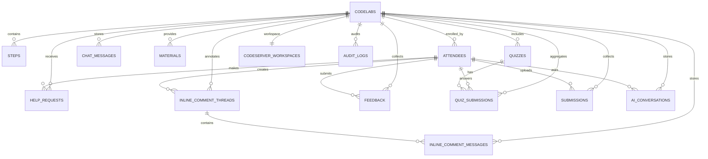

# 데이터베이스 스키마

Open Codelabs의 SQLite 데이터베이스 스키마를 설명합니다.

## ERD (Entity Relationship Diagram)



## 테이블 설명

### codelabs

Codelab의 메타데이터와 설정을 저장합니다.

```sql
CREATE TABLE IF NOT EXISTS codelabs (
    id VARCHAR(255) PRIMARY KEY NOT NULL,
    title VARCHAR(255) NOT NULL,
    description TEXT NOT NULL,
    author VARCHAR(255) NOT NULL,
    created_at TEXT DEFAULT CURRENT_TIMESTAMP,
    is_public INTEGER NOT NULL DEFAULT 1,
    quiz_enabled INTEGER DEFAULT 0,
    require_quiz INTEGER DEFAULT 0,
    require_feedback INTEGER DEFAULT 0,
    guide_markdown TEXT
);
```

| 컬럼 | 타입 | 설명 | 제약 |
|------|------|------|------|
| `id` | VARCHAR | UUID | PRIMARY KEY |
| `title` | VARCHAR | Codelab 제목 | NOT NULL |
| `description` | TEXT | Codelab 설명 | NOT NULL |
| `author` | VARCHAR | 작성자 이름 | NOT NULL |
| `created_at` | TEXT | 생성 시간 | DEFAULT CURRENT_TIMESTAMP |
| `is_public` | INTEGER | 공개 여부 (1: 공개, 0: 비공개) | DEFAULT 1 |
| `quiz_enabled` | INTEGER | 퀴즈 활성화 여부 | DEFAULT 0 |
| `require_quiz` | INTEGER | 수료 시 퀴즈 통과 필수 여부 | DEFAULT 0 |
| `require_feedback` | INTEGER | 수료 시 피드백 제출 필수 여부 | DEFAULT 0 |
| `guide_markdown` | TEXT | 준비 가이드 Markdown | - |

### steps

Codelab의 개별 단계를 저장합니다.

```sql
CREATE TABLE IF NOT EXISTS steps (
    id VARCHAR(255) PRIMARY KEY NOT NULL,
    codelab_id VARCHAR(255) NOT NULL,
    step_number INTEGER NOT NULL,
    title VARCHAR(255) NOT NULL,
    content_markdown TEXT NOT NULL,
    FOREIGN KEY (codelab_id) REFERENCES codelabs(id) ON DELETE CASCADE
);
```

| 컬럼 | 타입 | 설명 | 제약 |
|------|------|------|------|
| `id` | VARCHAR | UUID | PRIMARY KEY |
| `codelab_id` | VARCHAR | 속한 Codelab ID | FOREIGN KEY |
| `step_number` | INTEGER | 단계 순서 (1부터 시작) | NOT NULL |
| `title` | VARCHAR | Step 제목 | NOT NULL |
| `content_markdown` | TEXT | Markdown 콘텐츠 | NOT NULL |

### attendees

Codelab 참가자 정보를 저장합니다.

```sql
CREATE TABLE IF NOT EXISTS attendees (
    id VARCHAR(255) PRIMARY KEY NOT NULL,
    codelab_id VARCHAR(255) NOT NULL,
    name VARCHAR(255) NOT NULL,
    code VARCHAR(255) NOT NULL,
    email VARCHAR(255),
    created_at TEXT DEFAULT CURRENT_TIMESTAMP,
    current_step INTEGER DEFAULT 1,
    is_completed INTEGER DEFAULT 0,
    completed_at TEXT,
    FOREIGN KEY (codelab_id) REFERENCES codelabs(id) ON DELETE CASCADE
);
```

| 컬럼 | 타입 | 설명 | 제약 |
|------|------|------|------|
| `id` | VARCHAR | UUID | PRIMARY KEY |
| `codelab_id` | VARCHAR | 참여 중인 Codelab ID | FOREIGN KEY |
| `name` | VARCHAR | 참가자 이름 | NOT NULL |
| `code` | VARCHAR | 참가 코드 | NOT NULL |
| `email` | VARCHAR | 이메일 (선택) | - |
| `current_step` | INTEGER | 현재 진행 중인 Step 번호 | DEFAULT 1 |
| `is_completed` | INTEGER | 수료 여부 (1: 완료, 0: 진행 중) | DEFAULT 0 |
| `completed_at` | TEXT | 수료 일시 | - |
| `created_at` | TEXT | 등록 시간 | DEFAULT CURRENT_TIMESTAMP |

### help_requests

참가자의 도움 요청을 저장합니다.

```sql
CREATE TABLE IF NOT EXISTS help_requests (
    id VARCHAR(255) PRIMARY KEY NOT NULL,
    codelab_id VARCHAR(255) NOT NULL,
    attendee_id VARCHAR(255) NOT NULL,
    step_number INTEGER NOT NULL,
    status VARCHAR(50) DEFAULT 'pending',
    created_at TEXT DEFAULT CURRENT_TIMESTAMP,
    FOREIGN KEY (codelab_id) REFERENCES codelabs(id) ON DELETE CASCADE,
    FOREIGN KEY (attendee_id) REFERENCES attendees(id) ON DELETE CASCADE
);
```

| 컬럼 | 타입 | 설명 | 제약 |
|------|------|------|------|
| `id` | VARCHAR | UUID | PRIMARY KEY |
| `codelab_id` | VARCHAR | Codelab ID | FOREIGN KEY |
| `attendee_id` | VARCHAR | 요청자 ID | FOREIGN KEY |
| `step_number` | INTEGER | 막힌 Step 번호 | NOT NULL |
| `status` | VARCHAR | 상태 (pending/resolved) | DEFAULT 'pending' |
| `created_at` | TEXT | 요청 시간 | DEFAULT CURRENT_TIMESTAMP |

### chat_messages

실시간 채팅 및 DM 메시지를 저장합니다.

```sql
CREATE TABLE IF NOT EXISTS chat_messages (
    id VARCHAR(255) PRIMARY KEY NOT NULL,
    codelab_id VARCHAR(255) NOT NULL,
    sender_name VARCHAR(255) NOT NULL,
    message TEXT NOT NULL,
    created_at TEXT DEFAULT CURRENT_TIMESTAMP,
    msg_type VARCHAR(50) DEFAULT 'chat',
    target_id VARCHAR(255),
    FOREIGN KEY (codelab_id) REFERENCES codelabs(id) ON DELETE CASCADE
);
```

| 컬럼 | 타입 | 설명 | 제약 |
|------|------|------|------|
| `id` | VARCHAR | UUID | PRIMARY KEY |
| `codelab_id` | VARCHAR | Codelab ID | FOREIGN KEY |
| `sender_name` | VARCHAR | 발신자 이름 | NOT NULL |
| `message` | TEXT | 메시지 내용 | NOT NULL |
| `msg_type` | VARCHAR | 타입 (chat/dm) | DEFAULT 'chat' |
| `target_id` | VARCHAR | DM 대상 ID (Attendee ID) | - |
| `created_at` | TEXT | 전송 시간 | DEFAULT CURRENT_TIMESTAMP |

### inline_comment_threads

본문(Guide/Step) 하이라이트 앵커와 스레드 메타데이터를 저장합니다.

```sql
CREATE TABLE IF NOT EXISTS inline_comment_threads (
    id VARCHAR(255) PRIMARY KEY NOT NULL,
    codelab_id VARCHAR(255) NOT NULL,
    anchor_key VARCHAR(512) NOT NULL,
    target_type VARCHAR(16) NOT NULL,
    target_step_id VARCHAR(255),
    start_offset INTEGER NOT NULL,
    end_offset INTEGER NOT NULL,
    selected_text TEXT NOT NULL,
    content_hash VARCHAR(128) NOT NULL,
    created_by_attendee_id VARCHAR(255) NOT NULL,
    created_at TEXT DEFAULT CURRENT_TIMESTAMP,
    FOREIGN KEY (codelab_id) REFERENCES codelabs(id) ON DELETE CASCADE,
    UNIQUE (codelab_id, anchor_key)
);
```

| 컬럼 | 타입 | 설명 | 제약 |
|------|------|------|------|
| `id` | VARCHAR | UUID | PRIMARY KEY |
| `codelab_id` | VARCHAR | Codelab ID | FOREIGN KEY |
| `anchor_key` | VARCHAR | 고유 하이라이트 키 | UNIQUE (with codelab_id) |
| `target_type` | VARCHAR | 대상 타입 (`step`/`guide`) | NOT NULL |
| `target_step_id` | VARCHAR | Step ID (`target_type=step`일 때) | - |
| `start_offset` | INTEGER | 시작 오프셋 | NOT NULL |
| `end_offset` | INTEGER | 종료 오프셋 | NOT NULL |
| `selected_text` | TEXT | 선택 텍스트 원문 | NOT NULL |
| `content_hash` | VARCHAR | 본문 버전 해시 | NOT NULL |
| `created_by_attendee_id` | VARCHAR | 생성자 참가자 ID | NOT NULL |
| `created_at` | TEXT | 생성 시간 | DEFAULT CURRENT_TIMESTAMP |

### inline_comment_messages

인라인 코멘트 스레드 내 메시지를 저장합니다.

```sql
CREATE TABLE IF NOT EXISTS inline_comment_messages (
    id VARCHAR(255) PRIMARY KEY NOT NULL,
    thread_id VARCHAR(255) NOT NULL,
    codelab_id VARCHAR(255) NOT NULL,
    author_role VARCHAR(16) NOT NULL,
    author_id VARCHAR(255) NOT NULL,
    author_name VARCHAR(255) NOT NULL,
    message TEXT NOT NULL,
    created_at TEXT DEFAULT CURRENT_TIMESTAMP,
    FOREIGN KEY (thread_id) REFERENCES inline_comment_threads(id) ON DELETE CASCADE,
    FOREIGN KEY (codelab_id) REFERENCES codelabs(id) ON DELETE CASCADE
);
```

| 컬럼 | 타입 | 설명 | 제약 |
|------|------|------|------|
| `id` | VARCHAR | UUID | PRIMARY KEY |
| `thread_id` | VARCHAR | 스레드 ID | FOREIGN KEY |
| `codelab_id` | VARCHAR | Codelab ID | FOREIGN KEY |
| `author_role` | VARCHAR | 작성자 역할 (`attendee`/`admin`) | NOT NULL |
| `author_id` | VARCHAR | 작성자 식별자 | NOT NULL |
| `author_name` | VARCHAR | 작성자 표시명 | NOT NULL |
| `message` | TEXT | 메시지 본문 | NOT NULL |
| `created_at` | TEXT | 생성 시간 | DEFAULT CURRENT_TIMESTAMP |

### feedback

참가자 피드백을 저장합니다.

```sql
CREATE TABLE IF NOT EXISTS feedback (
    id VARCHAR(255) PRIMARY KEY,
    codelab_id VARCHAR(255) NOT NULL,
    attendee_id VARCHAR(255),
    difficulty VARCHAR(50) NOT NULL,
    satisfaction VARCHAR(50) NOT NULL,
    comment TEXT,
    created_at TEXT DEFAULT CURRENT_TIMESTAMP,
    FOREIGN KEY (codelab_id) REFERENCES codelabs(id) ON DELETE CASCADE
);
```

| 컬럼 | 타입 | 설명 | 제약 |
|------|------|------|------|
| `id` | VARCHAR | UUID | PRIMARY KEY |
| `codelab_id` | VARCHAR | Codelab ID | FOREIGN KEY |
| `attendee_id` | VARCHAR | 제출자 ID | UNIQUE (with codelab_id) |
| `difficulty` | VARCHAR | 난이도 (1-5) | NOT NULL |
| `satisfaction` | VARCHAR | 만족도 (1-5) | NOT NULL |
| `comment` | TEXT | 의견 (선택) | - |
| `created_at` | TEXT | 제출 시간 | DEFAULT CURRENT_TIMESTAMP |

### materials

코드랩에 첨부된 자료(링크 또는 파일)를 저장합니다.

```sql
CREATE TABLE IF NOT EXISTS materials (
    id VARCHAR(255) PRIMARY KEY NOT NULL,
    codelab_id VARCHAR(255) NOT NULL,
    title VARCHAR(255) NOT NULL,
    material_type VARCHAR(50) NOT NULL,
    link_url TEXT,
    file_path TEXT,
    created_at TEXT DEFAULT CURRENT_TIMESTAMP,
    FOREIGN KEY (codelab_id) REFERENCES codelabs(id) ON DELETE CASCADE
);
```

| 컬럼 | 타입 | 설명 | 제약 |
|------|------|------|------|
| `id` | VARCHAR | UUID | PRIMARY KEY |
| `codelab_id` | VARCHAR | Codelab ID | FOREIGN KEY |
| `title` | VARCHAR | 자료 제목 | NOT NULL |
| `material_type` | VARCHAR | 유형 (link/file) | NOT NULL |
| `link_url` | TEXT | 링크 URL | - |
| `file_path` | TEXT | 파일 경로 | - |
| `created_at` | TEXT | 등록 시간 | DEFAULT CURRENT_TIMESTAMP |

### quizzes

코드랩에 포함된 퀴즈 문항을 저장합니다.

```sql
CREATE TABLE IF NOT EXISTS quizzes (
    id VARCHAR(255) PRIMARY KEY NOT NULL,
    codelab_id VARCHAR(255) NOT NULL,
    question TEXT NOT NULL,
    options TEXT NOT NULL,
    correct_answer INTEGER NOT NULL,
    created_at TEXT DEFAULT CURRENT_TIMESTAMP,
    quiz_type TEXT DEFAULT 'multiple_choice'
);
```

| 컬럼 | 타입 | 설명 | 제약 |
|------|------|------|------|
| `id` | VARCHAR | UUID | PRIMARY KEY |
| `codelab_id` | VARCHAR | Codelab ID | FOREIGN KEY |
| `question` | TEXT | 문제 내용 | NOT NULL |
| `options` | TEXT | 선택지 (JSON Array) | NOT NULL |
| `correct_answer` | INTEGER | 정답 인덱스 또는 값 | NOT NULL |
| `quiz_type` | TEXT | 유형 (multiple_choice/descriptive) | DEFAULT 'multiple_choice' |
| `created_at` | TEXT | 생성 시간 | DEFAULT CURRENT_TIMESTAMP |

### quiz_submissions

참가자가 제출한 퀴즈 답변과 채점 결과를 저장합니다.

```sql
CREATE TABLE IF NOT EXISTS quiz_submissions (
    id VARCHAR(255) PRIMARY KEY NOT NULL,
    codelab_id VARCHAR(255) NOT NULL,
    attendee_id VARCHAR(255) NOT NULL,
    quiz_id VARCHAR(255) NOT NULL,
    answer TEXT NOT NULL,
    is_correct INTEGER NOT NULL,
    created_at TEXT DEFAULT CURRENT_TIMESTAMP,
    FOREIGN KEY (codelab_id) REFERENCES codelabs(id) ON DELETE CASCADE,
    FOREIGN KEY (attendee_id) REFERENCES attendees(id) ON DELETE CASCADE,
    FOREIGN KEY (quiz_id) REFERENCES quizzes(id) ON DELETE CASCADE
);
```

| 컬럼 | 타입 | 설명 | 제약 |
|------|------|------|------|
| `id` | VARCHAR | UUID | PRIMARY KEY |
| `codelab_id` | VARCHAR | Codelab ID | FOREIGN KEY |
| `attendee_id` | VARCHAR | 참가자 ID | FOREIGN KEY |
| `quiz_id` | VARCHAR | 퀴즈 ID | FOREIGN KEY |
| `answer` | TEXT | 제출 답변 | NOT NULL |
| `is_correct` | INTEGER | 정답 여부 (1: 정답, 0: 오답) | NOT NULL |
| `created_at` | TEXT | 제출 시간 | DEFAULT CURRENT_TIMESTAMP |

### submissions

참가자 제출 파일(과제)을 저장합니다.

```sql
CREATE TABLE IF NOT EXISTS submissions (
    id TEXT PRIMARY KEY,
    codelab_id TEXT NOT NULL,
    attendee_id TEXT NOT NULL,
    file_path TEXT NOT NULL,
    file_name TEXT NOT NULL,
    file_size INTEGER NOT NULL,
    created_at DATETIME DEFAULT CURRENT_TIMESTAMP,
    FOREIGN KEY (codelab_id) REFERENCES codelabs (id),
    FOREIGN KEY (attendee_id) REFERENCES attendees (id)
);
```

| 컬럼 | 타입 | 설명 | 제약 |
|------|------|------|------|
| `id` | TEXT | UUID | PRIMARY KEY |
| `codelab_id` | TEXT | Codelab ID | FOREIGN KEY |
| `attendee_id` | TEXT | 참가자 ID | FOREIGN KEY |
| `file_path` | TEXT | 저장 경로 | NOT NULL |
| `file_name` | TEXT | 원본 파일명 | NOT NULL |
| `file_size` | INTEGER | 파일 크기 | NOT NULL |
| `created_at` | DATETIME | 제출 시간 | DEFAULT CURRENT_TIMESTAMP |

### audit_logs

관리자/참가자 이벤트 로그를 저장합니다.

```sql
CREATE TABLE IF NOT EXISTS audit_logs (
    id VARCHAR(255) PRIMARY KEY NOT NULL,
    action VARCHAR(255) NOT NULL,
    actor_type VARCHAR(50) NOT NULL,
    actor_id VARCHAR(255),
    target_id VARCHAR(255),
    codelab_id VARCHAR(255),
    ip VARCHAR(64),
    user_agent TEXT,
    metadata TEXT,
    created_at TEXT DEFAULT CURRENT_TIMESTAMP
);
```

| 컬럼 | 타입 | 설명 | 제약 |
|------|------|------|------|
| `id` | VARCHAR | UUID | PRIMARY KEY |
| `action` | VARCHAR | 이벤트 키 | NOT NULL |
| `actor_type` | VARCHAR | actor 유형 (admin/attendee) | NOT NULL |
| `actor_id` | VARCHAR | actor ID | - |
| `target_id` | VARCHAR | 대상 ID | - |
| `codelab_id` | VARCHAR | Codelab ID | - |
| `ip` | VARCHAR | 요청 IP | - |
| `user_agent` | TEXT | User-Agent | - |
| `metadata` | TEXT | 추가 메타데이터(JSON) | - |
| `created_at` | TEXT | 생성 시간 | DEFAULT CURRENT_TIMESTAMP |

### codeserver_workspaces

코드 서버 워크스페이스를 저장합니다.

```sql
CREATE TABLE IF NOT EXISTS codeserver_workspaces (
    id TEXT PRIMARY KEY DEFAULT (lower(hex(randomblob(16)))),
    codelab_id TEXT NOT NULL UNIQUE,
    url TEXT NOT NULL,
    created_at TEXT NOT NULL DEFAULT (datetime('now')),
    structure_type TEXT NOT NULL DEFAULT 'branch',
    FOREIGN KEY (codelab_id) REFERENCES codelabs(id) ON DELETE CASCADE
);
```

| 컬럼 | 타입 | 설명 | 제약 |
|------|------|------|------|
| `id` | TEXT | UUID | PRIMARY KEY |
| `codelab_id` | TEXT | Codelab ID | UNIQUE, FOREIGN KEY |
| `url` | TEXT | 워크스페이스 경로 | NOT NULL |
| `structure_type` | TEXT | 구조 유형 (branch/folder) | DEFAULT 'branch' |
| `created_at` | TEXT | 생성 시간 | DEFAULT datetime('now') |

### ai_conversations

AI 질문/응답 히스토리를 저장합니다.

```sql
CREATE TABLE IF NOT EXISTS ai_conversations (
    id TEXT PRIMARY KEY,
    codelab_id TEXT NOT NULL,
    user_id TEXT NOT NULL,
    user_type TEXT NOT NULL,
    user_name TEXT NOT NULL,
    step_number INTEGER,
    question TEXT NOT NULL,
    answer TEXT NOT NULL,
    model TEXT,
    created_at TIMESTAMP DEFAULT CURRENT_TIMESTAMP,
    FOREIGN KEY (codelab_id) REFERENCES codelabs(id) ON DELETE CASCADE
);
```

| 컬럼 | 타입 | 설명 | 제약 |
|------|------|------|------|
| `id` | TEXT | UUID | PRIMARY KEY |
| `codelab_id` | TEXT | Codelab ID | FOREIGN KEY |
| `user_id` | TEXT | 사용자 ID | NOT NULL |
| `user_type` | TEXT | 사용자 유형 (admin/attendee) | NOT NULL |
| `user_name` | TEXT | 사용자 이름 | NOT NULL |
| `step_number` | INTEGER | 단계 번호 | - |
| `question` | TEXT | 질문 | NOT NULL |
| `answer` | TEXT | 답변 | NOT NULL |
| `model` | TEXT | 모델명 | - |
| `created_at` | TIMESTAMP | 생성 시간 | DEFAULT CURRENT_TIMESTAMP |

## 마이그레이션 목록

시스템은 `sqlx`를 사용하여 데이터베이스 스키마를 관리합니다. `backend/migrations/` 폴더 내의 파일들은 다음 순서로 적용됩니다.

1. `20251226161500_init.sql`: 초기 테이블(codelabs, steps) 생성
2. `20251226161600_attendees.sql`: 참가자, 도움 요청, 채팅 테이블 생성
3. `20251226161700_chat_enhancements.sql`: 채팅 유형 및 대상 필드 추가
4. `20251227001500_attendee_progress.sql`: 참가자 진행 단계 필드 추가
5. `20251227160000_create_feedback.sql`: 피드백 테이블 생성
6. `20251227161000_add_attendee_feedback.sql`: 피드백 제출자 정보 및 제약 추가
7. `20251227162000_add_is_public_to_codelabs.sql`: 코드랩 공개 여부 필드 추가
8. `20251229150000_add_materials.sql`: 첨부 자료 테이블 생성
9. `20251229160000_add_completion_to_attendees.sql`: 수료 상태 및 일시 필드 추가
10. `20251229161000_quizzes.sql`: 퀴즈 설정 필드 및 퀴즈 테이블 생성
11. `20251230113000_add_quiz_type.sql`: 퀴즈 유형 필드 추가
12. `20251230120000_quiz_submissions.sql`: 퀴즈 제출 결과 테이블 생성
13. `20251231120000_add_guide_to_codelabs.sql`: Codelab 가이드 필드 추가
14. `20251231130000_submissions.sql`: 제출물 테이블 생성
15. `20260102090000_audit_logs.sql`: 감사 로그 테이블 생성
16. `20260129000000_codeserver_containers.sql`: 코드 서버 워크스페이스 테이블 생성
17. `20260129100000_add_workspace_structure_type.sql`: 워크스페이스 구조 유형 추가
18. `20260130000000_add_email_to_attendees.sql`: 참가자 이메일 필드 추가
19. `20260130010000_ai_conversations.sql`: AI 대화 테이블 생성
20. `20260213200000_inline_comments.sql`: 인라인 코멘트 스레드/메시지 테이블 생성
